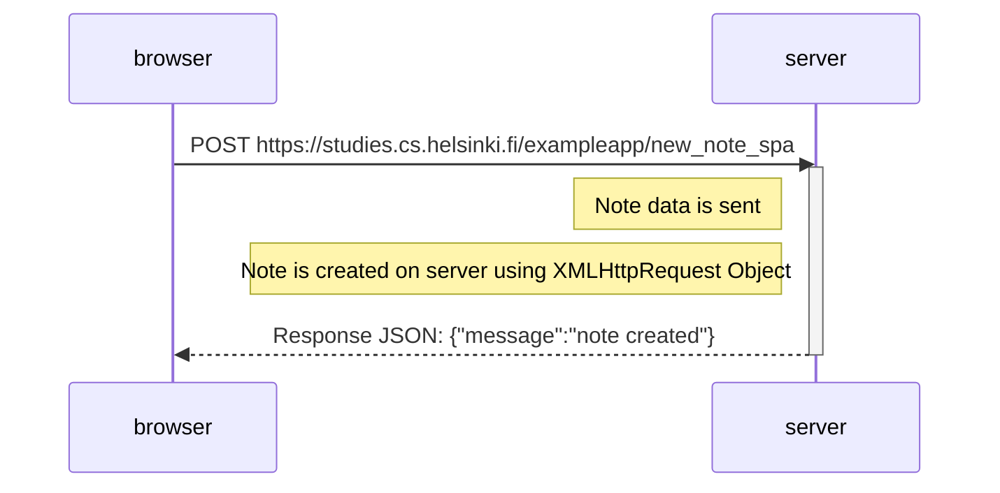

```mermaid
sequenceDiagram
    participant browser
    participant server

    browser->>server: POST https://studies.cs.helsinki.fi/exampleapp/new_note_spa
    activate server
    Note left of server: Note data is sent
    Note left of server: Note is created on server using XMLHttpRequest Object
    server-->>browser: Response JSON: {"message":"note created"}
    deactivate server
```
